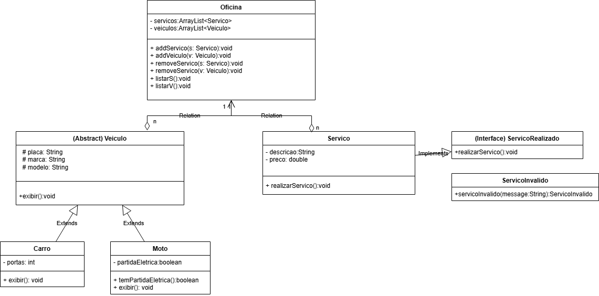

# 🔧 Oficina Mecânica

Um projeto em Java que simula o funcionamento de uma oficina mecânica, com funcionalidades básicas de cadastro de veículos e serviços.

## 🧭 Cenário do Problema

O projeto representa uma aplicação de terminal voltada à gestão de uma oficina mecânica.  
Permite o cadastro de veículos (carros e motos), além da adição, remoção e listagem de serviços realizados.

### Funcionalidades disponíveis

- Adicionar veículo (Carro ou Moto)
- Adicionar serviço com descrição e preço
- Listar veículos cadastrados
- Listar serviços cadastrados
- Validação de preços inválidos para serviços

## 🛠️ Tecnologias utilizadas

- Java 24
- Orientação a Objetos (Herança, Polimorfismo, Abstração)
- Exceções Personalizadas

## 🗂️ Estrutura do Projeto

- `Main.java`: Classe principal com o fluxo de execução e menu.
- `Veiculo.java`: Classe abstrata base para os veículos.
- `Carro.java`, `Moto.java`: Especializações da classe `Veiculo`.
- `Servico.java`: Representa um serviço da oficina.
- `ServicoRealizavel.java`: Interface com o método `realizarServico()`.
- `ServicoInvalidoException.java`: Exceção para tratar preços inválidos.
- `Oficina.java`: Controla a lista de veículos e serviços.

## 📊 Diagrama UML do sistema




## ▶️ Como executar

1. **Compile todos os arquivos Java:**
   ```bash
   javac *.java
   ```

2. **Execute a aplicação:**
   ```bash
   java Main
   ```

---

**Feito por:** Carlos Eduardo Garcez Mattos
